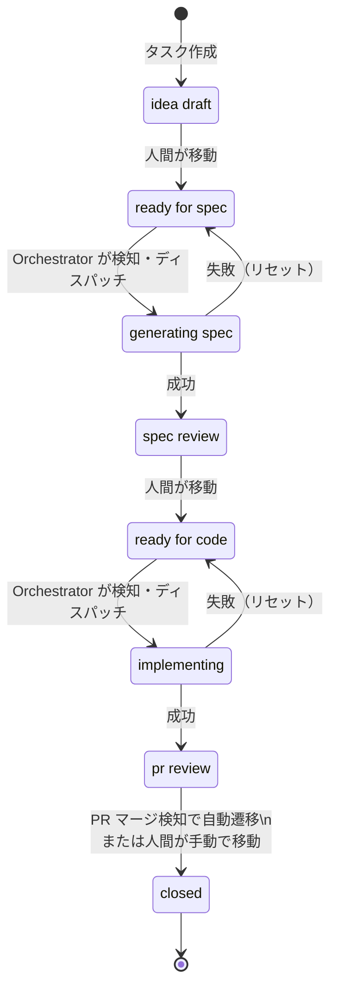
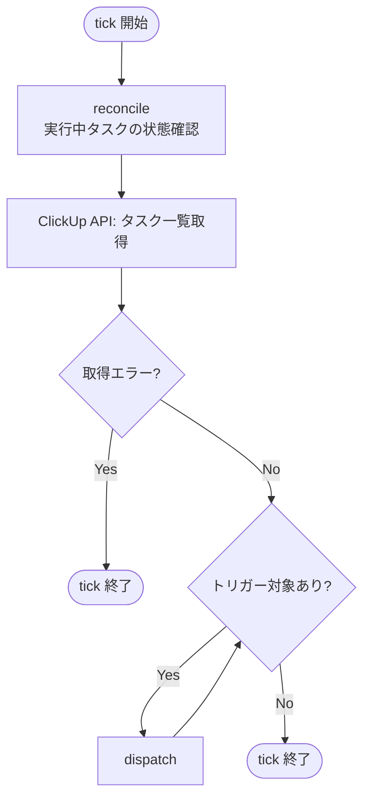
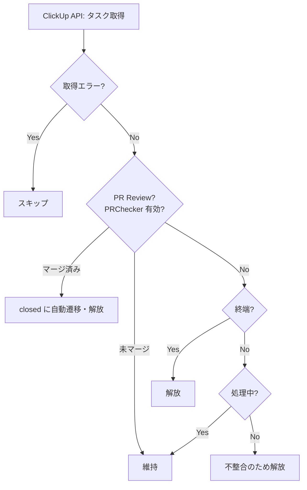
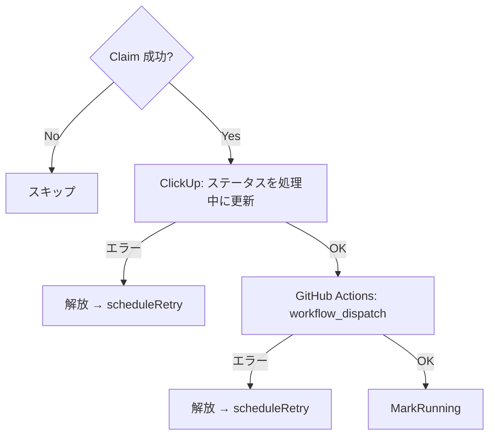
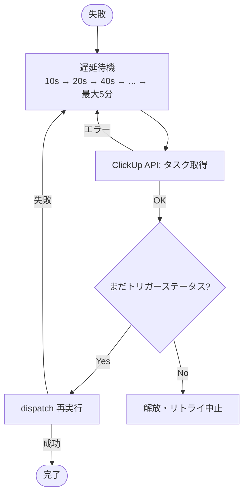

# 処理フロー図

## 1. 全体ステータスフロー

タスクが `idea draft` から `closed` に至るまでのステータス遷移。人間の操作と自動処理が交互に行われる。

---

## 2. Orchestrator の tick 処理フロー

10秒間隔（デフォルト）で実行される1ティックの処理。reconcile → fetch → dispatch の順で実行する。

### 2.1 tick 全体

### 2.2 reconcile（実行中タスクごと）

### 2.3 dispatch（タスクごと）

---

## 3. リトライフロー

ディスパッチ失敗時に指数バックオフでリトライする。遅延 = `min(10000 × 2^(attempt-1), 300000)` ms。

