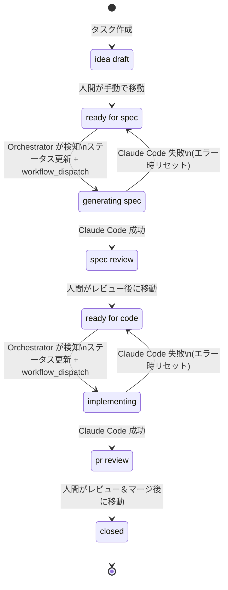
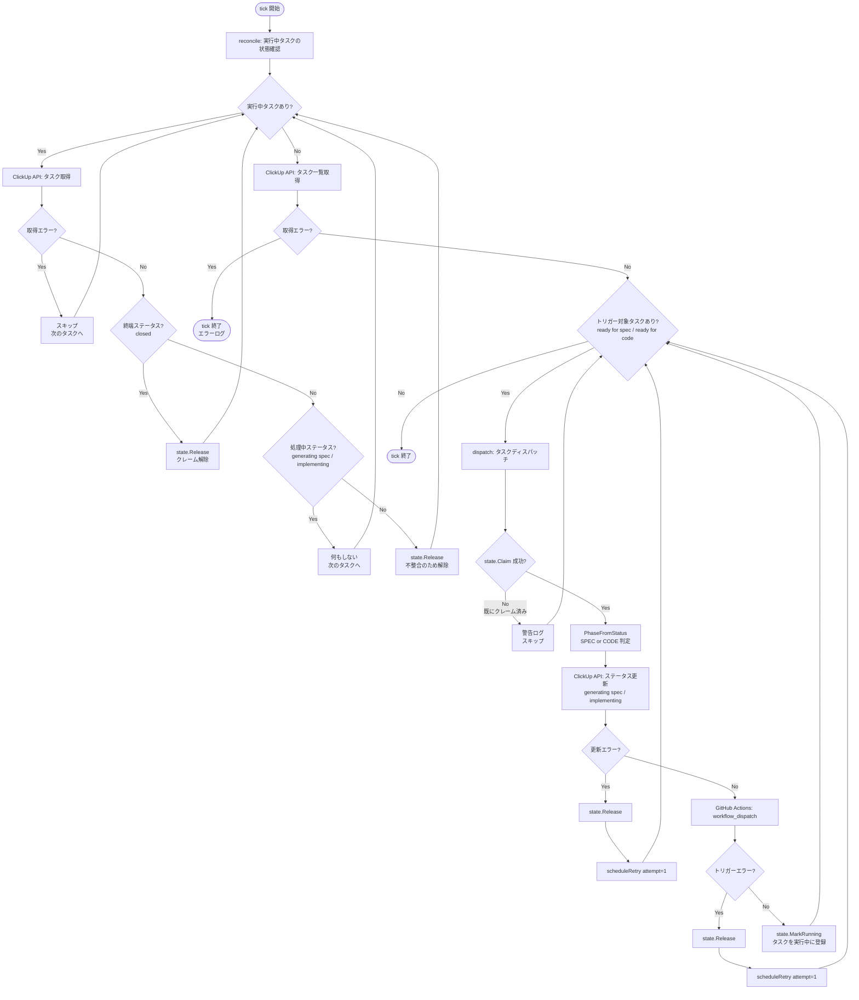
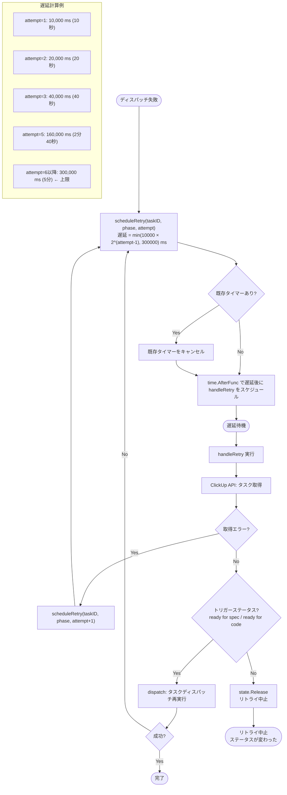

# 処理フロー図

## 1. 全体ステータスフロー

タスクが `idea draft` から `closed` に至るまでのステータス遷移。人間の操作と自動処理が交互に行われる。

---

## 2. Orchestrator の tick 処理フロー

10秒間隔（デフォルト）で実行される1ティックの処理内容。リコンシリエーションによる状態修正後にタスクの検知・ディスパッチを行う。

---

## 3. リトライフロー

ClickUp API 更新または GitHub Actions トリガーが失敗した場合に実行される指数バックオフリトライ。最大遅延は 300,000 ms（5分）。

